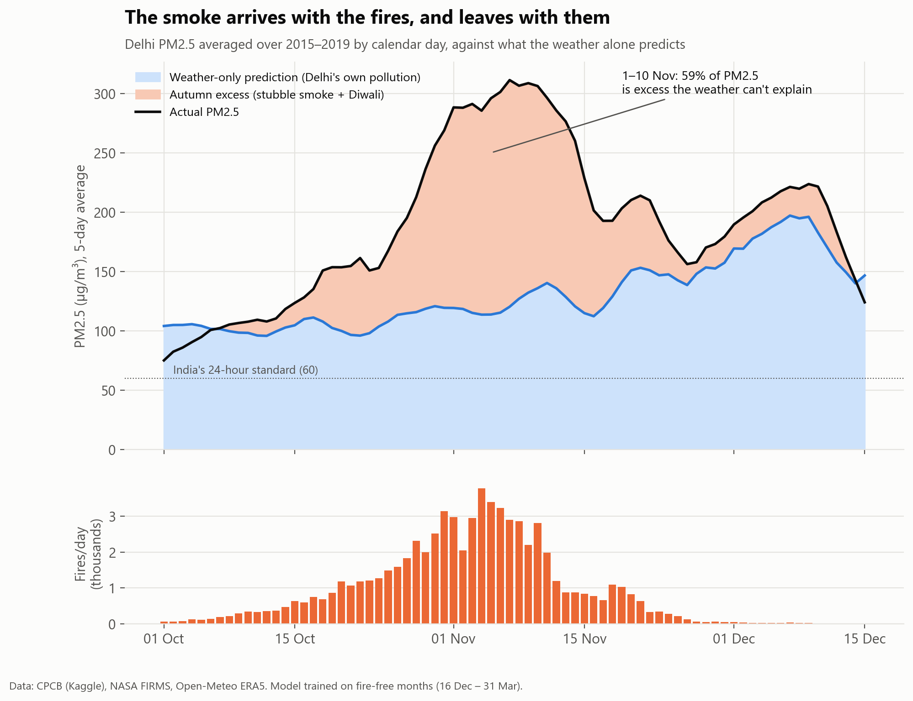
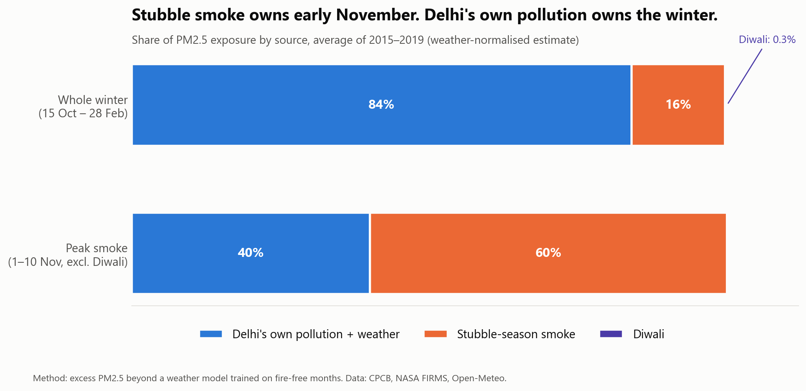
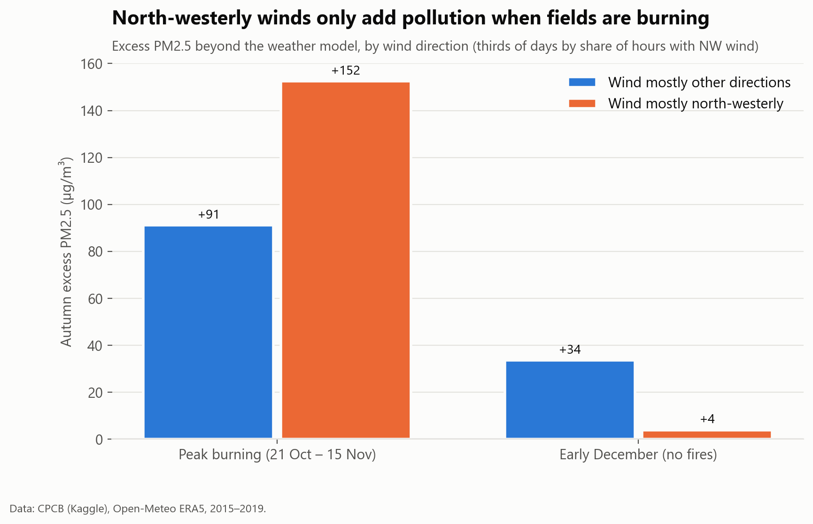
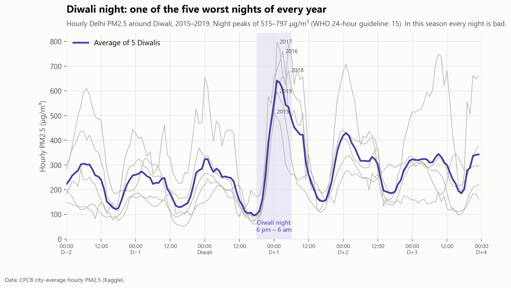
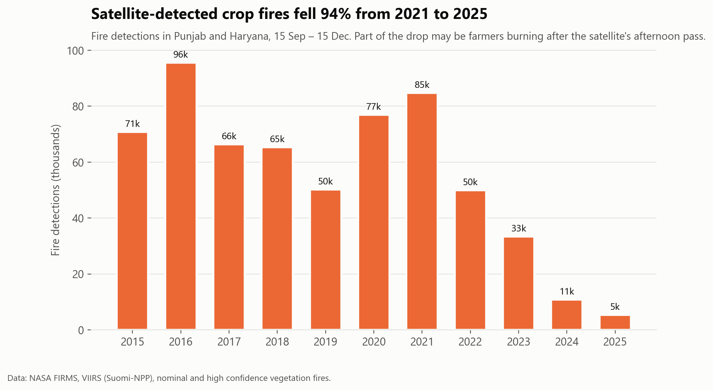

# Who's really choking Delhi: Diwali crackers or Punjab's stubble fires?

Every November, Delhi's air becomes some of the worst in the world, and every November people argue over who's to blame: Diwali firecrackers or crop-residue fires in Punjab and Haryana. This project tests both using five seasons of measured PM2.5 (2015–2019), **600,000+ NASA satellite fire detections** and hourly weather data.



<!-- business:start -->
## Business impact

- **Question:** To cut November smog, should Delhi tackle Diwali firecrackers or crop fires?
- **Key finding:** Crop fires. They drive about 60% of early-November PM2.5, while Diwali adds about 2% of the season's extra pollution. Over the whole winter, 84% of the pollution is Delhi's own, trapped by the weather.
- **Recommendation:** Fund crop-residue alternatives for October–November, and year-round controls on Delhi's own sources (traffic, industry, dust) for the winter. A firecracker ban addresses one night.
- **Estimated impact:** **~60%** of early-November PM2.5 from crop-fire smoke; Diwali adds about 2% of the season's extra pollution.
- **Case study:** [boredmongoose.github.io/projects/delhi.html](https://boredmongoose.github.io/projects/delhi.html)
<!-- business:end -->

## Short answer

| Suspect | Verdict | Evidence |
|---|---|---|
| **Diwali crackers** | **Real, but brief.** Diwali night is one of the five most polluted nights of every year, with hourly PM2.5 of 515–797 µg/m³. But it lasts hours, not weeks. | Over a season, it adds about **2%** as much pollution as the stubble-burning period. |
| **Stubble fires** | **The main driver in early November.** About **60%** of Delhi's PM2.5 on 1–10 November is extra pollution the weather can't explain. From mid-October to the end of November the figure is **~40%**. | The excess appears with the fires and disappears when they stop. It's 67% larger when the wind blows from Punjab. |
| **Delhi itself** | **The biggest share over the whole winter.** About **84%** of PM2.5 exposure from 15 October to 28 February is Delhi's own pollution (traffic, industry, dust, household burning) trapped by winter weather. | That's why December and January stay toxic after the fires end. |



## Why the obvious analysis is wrong

The obvious approach is to regress Delhi's daily PM2.5 on the daily fire count. That gives a large, highly "significant" effect of about 36 µg/m³ per 1,000 fires.

As a **placebo test**, I fed the same model the *wrong year's* fires (same calendar dates, previous or next year). The fake fires "explained" the pollution even better (about 45 µg/m³ per 1,000). Fires and smog both peak in November, partly because November weather traps pollution, so the simple regression was measuring the season, not the smoke. I dropped that approach.

## Method: weather normalisation

1. **Learn how weather alone drives Delhi's pollution.** I fitted a model on fire-free months (16 Dec – 31 Mar, which have 1–2% of autumn's fire count). Delhi's own emissions continue then and winter weather traps them. The model is a log-linear regression on mixing height (how high pollution can disperse), wind speed and direction, temperature, humidity, rain and day of week. Held-out R² is 0.42. Doubling the afternoon mixing height cuts PM2.5 by about 26%.
2. **Predict October–November from the weather alone.** This is the air Delhi would have from its usual emissions under that season's weather.
3. **Measure the gap.** Actual minus predicted is the **autumn excess**: pollution that only autumn brings.

**Checks that it measures smoke and not model error:**

| Period | Fires/day | Autumn excess (µg/m³) |
|---|---|---|
| 1–10 Oct (before burning) | 164 | **−7** (≈ 0 ✓) |
| 21–31 Oct | 1,783 | +82 |
| 1–10 Nov (peak burning) | 2,914 | **+178** |
| 21–30 Nov | 216 | +31 |
| 1–15 Dec (after burning; the model never saw these days) | 24 | **+20** (≈ 0 ✓) |

- **Smoke fingerprint:** at peak burning, the excess is **+152 µg/m³ on north-westerly wind days against +91** on other days. In early December, with no fires, north-westerly winds add nothing (+4 against +34).

  
- **Robustness:** five model variants (10 long-running stations only, a different training window, trend instead of season levels, and a gradient-boosting model) all give an excess of **85–100 µg/m³ (40–46% of PM2.5)** from mid-October to the end of November.



## Limitations

- **The excess is "autumn-only pollution", not proven stubble smoke.** Its timing and wind dependence point to the fires, but other autumn sources are mixed in.
- **The early-December check shows a +20 µg/m³ bias.** Subtracting it gives a lower bound of about a third of PM2.5 from mid-October to the end of November, against the 42% headline.
- **The measured PM2.5 data ends in mid-2020.** Satellite fire detections fell **94% from 2021 to 2025**, but whether Delhi's air improved can't be tested here. Some of that drop may also be farmers reportedly burning after the satellite's afternoon pass.
- **Five seasons is a small sample**, and the weather data comes from a single reanalysis grid point.



<!-- next:start -->
## Next steps

1. Extend the PM2.5 data past 2020 to test whether the air improved as fires fell 94%.
2. Use more weather grid points and station-level models.
3. Estimate the health cost of the smoke weeks (hospital visits, lost workdays).
<!-- next:end -->

## Tools

**Python:** pandas, statsmodels (OLS, HAC standard errors), scikit-learn (gradient boosting, cross-validation) and matplotlib (including a fire-density map built from raw GeoJSON). **APIs:** NASA FIRMS, Open-Meteo. The full analysis is in [`notebooks/delhi_smog_analysis.ipynb`](notebooks/delhi_smog_analysis.ipynb).

```
delhi-smog/
├── notebooks/
│   ├── delhi_smog_analysis.ipynb    # the analysis, with outputs
│   └── delhi_smog_analysis.py       # same notebook as plain Python (jupytext)
├── src/
│   ├── fetch_data.py                # NASA FIRMS + Open-Meteo downloads
│   ├── prepare_data.py              # cleaning; fires clipped to Punjab + Haryana borders
│   └── style.py                     # shared chart style
├── data/processed/                  # analysis-ready tables (CSV)
└── images/
```

## Reproduce

The analysis-ready tables in `data/processed/` and the state boundaries are included, so the notebook runs on a fresh clone:

```bash
pip install -r requirements.txt
jupyter notebook notebooks/delhi_smog_analysis.ipynb
```

To rebuild the tables from the raw sources, two inputs need a free sign-up:
1. A [NASA FIRMS map key](https://firms.modaps.eosdis.nasa.gov/api/map_key/), saved in a `.env` file as `FIRMS_MAP_KEY=your_key` (`.env` is git-ignored).
2. The CPCB data from Kaggle, [Air Quality Data in India (2015 - 2020)](https://www.kaggle.com/datasets/rohanrao/air-quality-data-in-india): put `city_day.csv`, `city_hour.csv`, `station_day.csv` and `stations.csv` in `data/raw/kaggle/`.

```bash
python src/fetch_data.py      # NASA FIRMS fire detections and Open-Meteo weather -> data/raw/
python src/prepare_data.py    # cleaning and joins -> data/processed/
```

*Data: CPCB via Kaggle (2015–2020), NASA FIRMS VIIRS S-NPP (2015–2025), Open-Meteo / ERA5 reanalysis, Natural Earth boundaries.*
